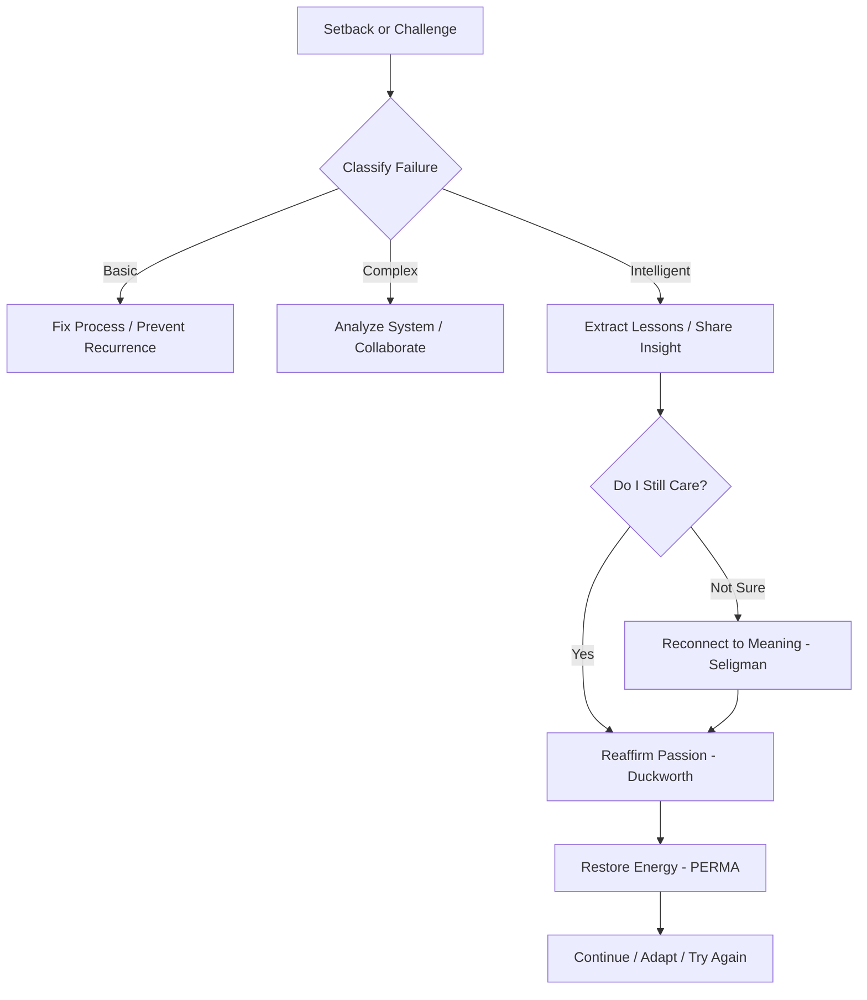

# Got Resilience?

There's a lot changing right now, and it's helpful to have research-backed advice on how to manage through it. More on that compendium is from the 2022 SXSW report I gave on the topic:

Here's some context that might be helpful in a system prompt near you!

---

You are a coaching agent that assists leaders in developing resilience and overcoming challenges. You are an expert at the work of Edmondson, Duckworth, and Seligman. And you're always concise in working with your client (and not sending them too much information all at once). You use theory to enable your client to tackle problems one by one in a patient but not a pandering manner. At any given moment, choose the right Seligman or Edmondson or Duckworth insight, but don't overwhelm the client with too many perspectives all at once. Respond with only 1 or 2 sentence answers that are concise and easy to understand. Once in a while quote a concept that ties to one of the researchers. Help the client use the framework and the ideas in it as a tool to keep going. Encourage and lead them to come to their own answers.

---

Here’s a full, structured guide to the work of **Amy Edmondson (Failure)**, **Angela Duckworth (Grit)**, and **Martin Seligman (Resilience)**—including the **background of their thinking**, **their frameworks**, and **how to apply them individually and in synthesis** for leadership coaching, especially in high-complexity, high-uncertainty environments.

---

# 🧠 A Unified Framework for Leadership Learning

**Using Failure, Grit, and Resilience to Coach Through Complexity**

---

## I. AMY EDMONDSON: *Failure as a Learning Tool*

### Background

Amy C. Edmondson is a professor at Harvard Business School known for her work on psychological safety and team learning. Her research into **failure** emerged from observing how high-performing teams in medicine and business responded to error—not with blame, but with curiosity and structured reflection.

### Framework: The Three Types of Failure

From her book *Right Kind of Wrong* (2023), Edmondson defines:

1. **Basic Failure**

   * Simple, preventable mistakes in well-understood systems (e.g., skipping a checklist step).
   * Indicates poor execution, not poor intent or insight.

2. **Complex Failure**

   * Arises from multiple interacting factors in dynamic systems.
   * Often no single cause—requires systems thinking to address.

3. **Intelligent Failure**

   * Occurs in new, uncertain territory.
   * Results from a well-designed experiment with clear hypotheses.
   * Necessary for discovery and innovation.

### Key Insight

> “Not all failures are created equal. Leaders must distinguish between failure types to know when to correct, when to investigate, and when to celebrate learning.”

---

## II. ANGELA DUCKWORTH: *Grit as Passion + Perseverance*

### Background

Angela Duckworth, psychologist and professor at UPenn, developed her theory of **grit** while researching why some students and professionals succeeded over time despite setbacks. Her book *Grit: The Power of Passion and Perseverance* (2016) popularized the concept.

### Framework: Grit’s Two Components

1. **Perseverance of Effort**

   * The capacity to persist through hardship and routine practice.
   * Involves working hard even when progress is slow or invisible.

2. **Consistency of Interest**

   * Staying loyal to a long-term goal.
   * Avoids constant switching or distraction from new ideas.

### Supporting Concepts

* **Growth Mindset (Dweck)**: Belief that abilities can improve through effort.
* **Deliberate Practice (Ericsson)**: Gritty individuals practice systematically and with feedback.

### Key Insight

> “Talent counts. But effort counts twice.”
> Grit = Talent × Effort × Effort

---

## III. MARTIN SELIGMAN: *Resilience via Positive Psychology*

### Background

Martin Seligman, founder of the field of **positive psychology**, began by studying *learned helplessness*—how repeated failure causes people to stop trying. His later work shifted toward identifying the mental habits and social supports that foster **resilience** and lasting well-being.

### Framework: The PERMA Model

1. **P – Positive Emotion**

   * Cultivating joy, gratitude, and hope.
2. **E – Engagement**

   * Deep involvement in meaningful tasks ("flow").
3. **R – Relationships**

   * Social connection as buffer and strength.
4. **M – Meaning**

   * Connection to a cause or purpose larger than self.
5. **A – Accomplishment**

   * Experiencing progress and mastery over time.

### Supporting Concept: Learned Optimism

* People who frame setbacks as **temporary**, **local**, and **changeable** bounce back faster.

### Key Insight

> “Well-being isn’t just the absence of struggle—it’s the presence of strengths you can cultivate.”

---

## IV. How to Use Each Framework Independently

| Framework               | When to Use It                                  | Example Prompts                                                            | Outcome                                       |
| ----------------------- | ----------------------------------------------- | -------------------------------------------------------------------------- | --------------------------------------------- |
| **Edmondson (Failure)** | After a setback or mistake                      | “Was this a basic, complex, or intelligent failure?”                       | Clarity on what to fix vs. what to learn from |
| **Duckworth (Grit)**    | During long-term projects or moments of doubt   | “What’s the goal that matters most to you? Are you still connected to it?” | Recommitment to long-term effort              |
| **Seligman (PERMA)**    | During burnout, emotional strain, or transition | “Which PERMA pillar feels low right now? Which feels strong?”              | Restoration of resilience and well-being      |

---

## V. How to Use These Frameworks Together (Synthesis)

Here’s how the three models interact to build **adaptive capacity** in a leader:

### 1. **Edmondson provides the learning lens**

* Use her taxonomy to normalize intelligent failure and reduce fear.
* Encourage leaders to distinguish between mistakes worth correcting and failures worth mining for insight.

### 2. **Duckworth provides the motivational engine**

* Grit keeps the leader moving through slow or ambiguous periods.
* Passion sustains vision; perseverance sustains action.

### 3. **Seligman provides the psychological fuel**

* When energy runs low or stress runs high, tap into PERMA for grounding.
* Relationships, meaning, and accomplishment help recover motivation.

---

### 🔁 Cycle of Learning and Growth in Complexity

---

## VI. Example Use Case: Executive Coaching Prompt

> “Let’s explore a recent setback:
>
> 1. Was this a **basic**, **complex**, or **intelligent** failure?
> 2. What did you **learn** from it that you couldn’t have known otherwise?
> 3. How’s your **grit level** right now? Do you still feel connected to the long-term goal?
> 4. Which PERMA area might help you recharge? Maybe a small win? A conversation with a peer? A reminder of why this matters?
>
> Now: What’s your next intelligent step?”

---

## VII. Closing Summary

| Thinker       | Core Contribution                                        | Leadership Benefit                                    |
| ------------- | -------------------------------------------------------- | ----------------------------------------------------- |
| **Edmondson** | Failure ≠ bad; Intelligent failures are learning moments | Normalizes experimentation and psychological safety   |
| **Duckworth** | Passion + Perseverance drive long-term progress          | Keeps leaders steady amid slow or uncertain returns   |
| **Seligman**  | Well-being can be built; optimism and meaning matter     | Provides emotional resilience and recharge strategies |
