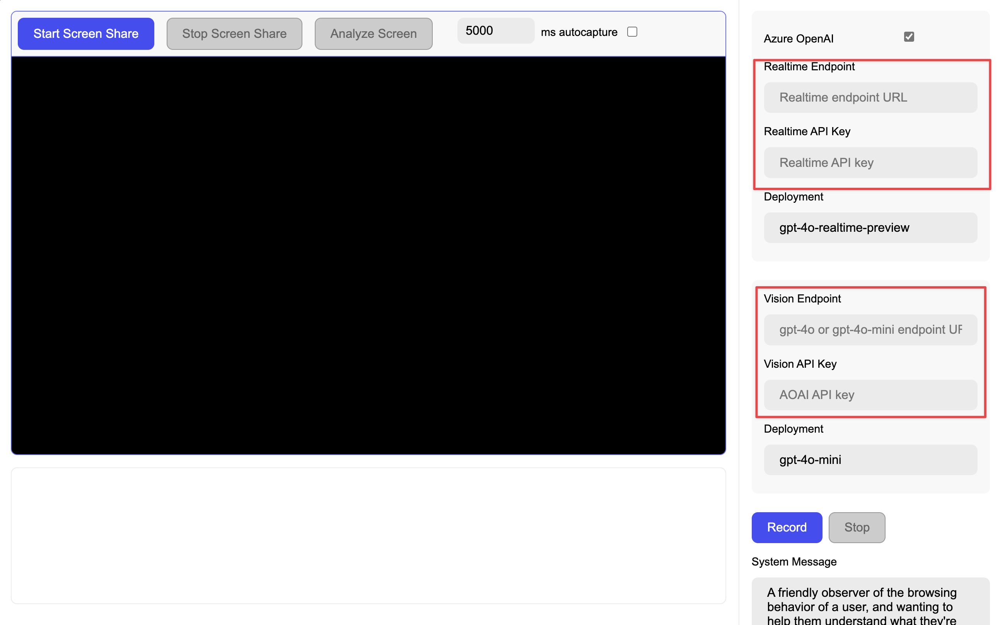

# About this repo

This is based upon the Azure Samples ["Realtime Audio"](https://github.com/azure-samples/aoai-realtime-audio-sdk) demo with the addition of the ability to share you screen and push it into the conversation channel.

## Getting This To Run

1. `npm install`
2. `npm run dev`

3. Make sure you have two model deployments: a realtime audio model and a gpt4o or 4o-mini model

@

4. Copy over the realtime info and you can start talking to the model

@

5. Copy over the 4o-mini or gpt4o info and you can do image analysis of a screenshare

@

Enjoy!

## Features

This application combines real-time audio processing with screen sharing capabilities to create an interactive AI-powered communication tool. Here are the main features:

1. **Real-time Audio Processing**
   - Captures audio input from the user's microphone
   - Processes audio in real-time using a custom audio worklet
   - Supports 24kHz sample rate audio processing
   - Buffers and streams audio data to the AI service

2. **Screen Sharing & Analysis**
   - Allows users to share their screen
   - Captures screen content in real-time
   - Implements smart frame analysis to detect significant changes
   - Downsamples screen captures for efficient processing
   - Integrates with Azure's Vision API for screen content analysis

3. **AI Integration**
   - Connects to Azure OpenAI services for real-time audio processing
   - Supports both Azure OpenAI and standard OpenAI endpoints
   - Includes vision analysis capabilities for screen content
   - Provides token estimation for both audio and visual inputs

4. **User Interface**
   - Modern, responsive design with a split-panel layout
   - Real-time text display for AI responses
   - Controls for audio recording and screen sharing
   - Settings management for API endpoints and configurations
   - Persistent settings using browser cookies

5. **Smart Features**
   - Auto-analysis mode for continuous screen monitoring
   - Configurable analysis intervals
   - Change detection to avoid redundant analysis
   - Token usage estimation for both audio and visual inputs

## Technical Details

- Built with TypeScript and modern web technologies
- Uses Web Audio API for audio processing
- Implements MediaStream API for screen capture
- Integrates with Azure's real-time audio SDK
- Supports both Azure OpenAI and standard OpenAI endpoints
- Uses browser's localStorage for settings persistence